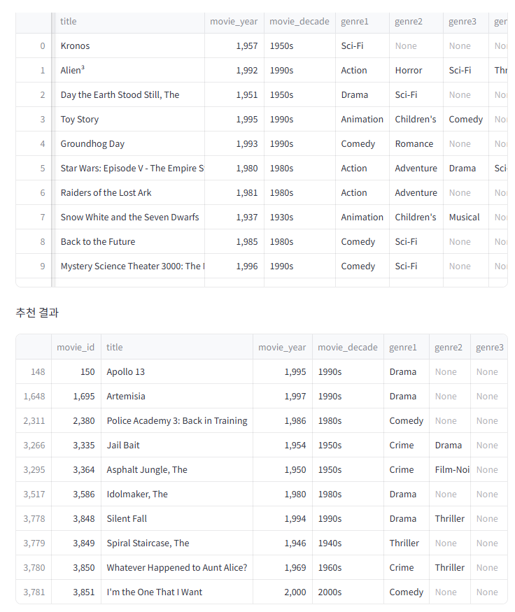

# [AutoInt, Movielens 1M] 추천 시스템 구축 프로젝트 📚

 
 
 

### 🖊️ 파일 설명
  - 250123_project_AutoInt.ipynb : 학습 노드의 데이터 분석, 전처리, 모델링 과정 학습
  - 250123_project_AutoInt+.ipynb : AutoInt에 대한 지식을 바탕으로 AutoInt+ 모델을 Tensorflow를 활용하여 구현
  - autoint.py, show_st.py : AutoInt 모델 활용 Streamlit 시각화 페이지를 위한 python 파일
  - autoint_plus.py, show_st_plus.py : AutoInt+ 모델 활용 Streamlit 페이지를 위한 python 파일

  - data/field_dims.npy : AutoInt 모델 차원 정보 저장
  - model/autoInt_model.weights.h5 : AutoInt 모델 가중치 정보 저장
  - data/field_dims_plus1.npy : AutoInt+ 모델 차원 정보 저장
  - model/autoIntMLP_model_1.weights.h5 : AutoInt+ 모델 가중치 정보 저장
  - data/field_dims_tuned.npy : AutoInt+ 모델 최적화 후 차원 정보 저장
  - model/autoIntMLP_model_tuned.weights.h5 : AutoInt+ 모델 가중치 정보 저장
 

### 🤦🏻‍♀️ Streamlit 구현 이미지

 

## 💻 Code References
- 
- 
- 
 
 
 

## 🗨️ Tools

